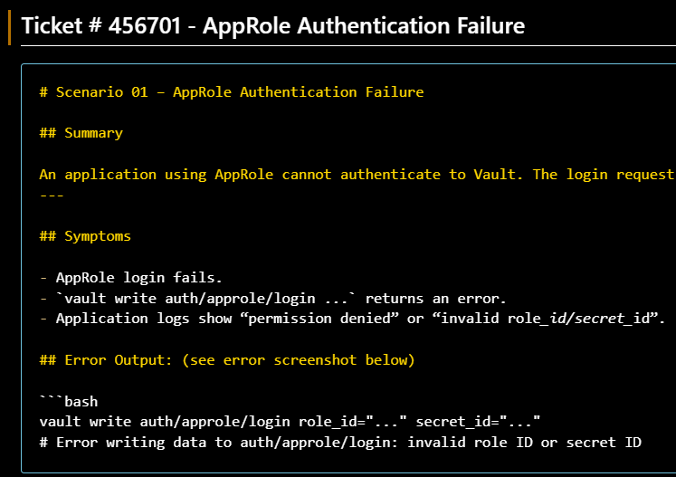

# Vault Troubleshooting Lab 

This project is a hands-on HashiCorp Vault troubleshooting lab built around issues I encountered while learning Vault. HashiCorp Vault is used to securely store and manage sensitive data like secrets, tokens, and credentials.

The lab includes troubleshooting scenarios that present specific errors, along with the commands used, what went wrong, and the step-by-step process to fix them. Each scenario is written like a mini support ticket, similar to what engineers see during a real support call.

The goal of this project is to walk through diagnosing and isolating Vault issues step‑by‑step in a ticket‑style format. It also shows the troubleshooting thought process that you can apply to Vault or technical issues in general.

<p align="left">
  
  <br>
  <em>Example troubleshooting scenario: AppRole authentication failure</em>
</p>

### Prerequisites 
No prior Vault setup required. The lab environment is fully automated after setup.

- **Docker Desktop** (mandatory)  
- **Docker Compose** (included with Docker Desktop)
- **Vault CLI** (optional installed locally)
- **jq** installed (for parsing JSON)
- A terminal environment (Git Bash, WSL, macOS Terminal, etc.)
- **VS Code** or any code editor (VS Code recommended) but all commands are executed in the terminal.

If you need help installing these tools, see the full setup guide below:  

[Vault Setup Guide](./docs/Vault-setup-guide.md)

---

### Lab Setup 

### 1. Install Visual Studio Code (Recommended)
```
Download VS Code:  see https://code.visualstudio.com/
```

### 2. Install Docker Desktop

Download from: https://www.docker.com/products/docker-desktop
```
After installation, make sure the Vault container is running before continuing.
```

### 3. Clone this project
This project is designed as a hands-on Vault troubleshooting lab.

To get the most value, clone the repository and follow the exercises locally:

```bash
git clone https://github.com/yyoung-50/vault-troubleshooting-lab.git
cd vault-troubleshooting-lab
```
### 4. Run the Lab Setup Script

- Run the lab setup script **reset-lab.sh** 
- If you get an error running the script, check the container is running and restart the container.
[Lab Setup Script Error](docs/Vault-setup-guide.md#lab-setup-script-error)

Run these two commands in the terminal:

```bash
source reset-lab.sh
vault status
```
Vault status output will show that Vault is initialized and sealed 

- Initialized: true
- Sealed: false

**Important:** Be sure to save the output from the reset lab script as you will need the "Root token"

- From the script output, save the **role ID**, **secret ID**, and **root token**.

You are now ready to work through the troubleshooting scenarios.

---

### Vault Troubleshooting Scenarios

This lab walks through real-world issues you’ll encounter when working with HashiCorp Vault.

**Vault troubleshooting topics:**
```
1. AppRole Authentication Failure
2. Permission Denied (Policy Issue)
3. Token Expired (TTL Issue)
4. KV v2 Path Confusion
5. Transit Decrypt Failure
6. Vault Seal Behavior
7. Wrong Mount Path
```

**Working with Scenario files** 

The Vault troubleshooting scenarios are written as short, self-contained “mini support tickets” where Vault is misconfigured. 

Scenarios are located in the scenarios/ directory. 

Each scenario includes the commands and solutions needed to diagnose and fix the issue.

**Follow steps for each scenario:**

- Read the scenario
- Reproduce the issue
- Diagnose the issue
- Apply the fix
- Key findings 

**Start with Scenario 01:** 👉 Click here: [AppRole Auth Failure](scenarios/01-approle-auth-failure.md)

If you need more help walking through the scenario files, here's a walk through guide:
[How to Work Through a Scenario](docs/How-to-Use-this-Lab.md)

After you complete a scenario run the setup script: [Lab Setup Script](../README.md#4-run-the-lab-setup-script)

You are now ready to go to the next scenario file:

### Additional Resources

- What is Vault? → [What is Vault?](https://developer.hashicorp.com/vault/docs/about-vault/what-is-vault?page=what-is-vault)
- What is Secret Sprawl? → [What is Secret Sprawl?](https://www.hashicorp.com/en/blog/secret-sprawl-is-costing-you-more-than-you-think)
- Vault Command Reference → [Vault Command Reference](https://developer.hashicorp.com/vault/docs/commands)
- Vault Troubleshooting → [Troubleshoot Vault](https://developer.hashicorp.com/vault/tutorials/monitoring/troubleshooting-vault)
- Vault Lab Setup → [Vault Lab Setup](docs/Vault-setup-guide.md)
- How to Use This Lab → [How to Use this Lab](docs/How-to-Use-this-Lab.md)

---

### Author

**Yvonne Young**  
*Cloud & Support Engineer*  
Focused on customer advocacy, troubleshooting, and clean documentation.

---

### 📫 Let's Connect

🔗 **LinkedIn:**  
https://www.linkedin.com/in/yvonne-young


